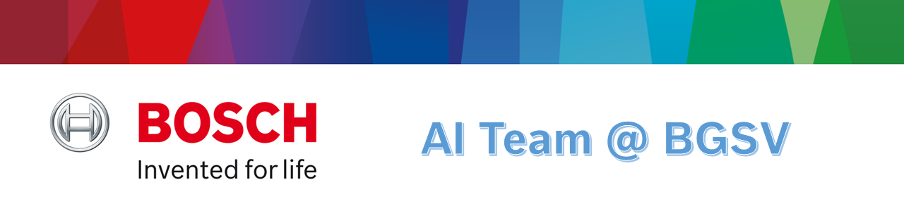
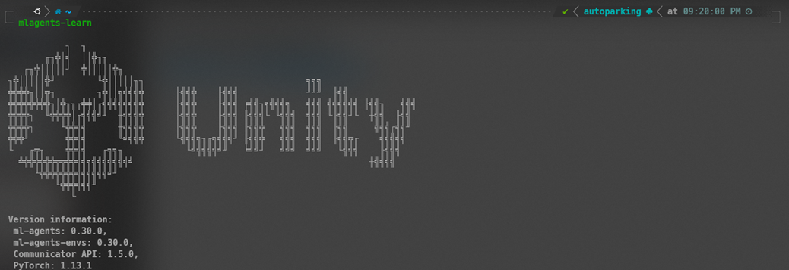
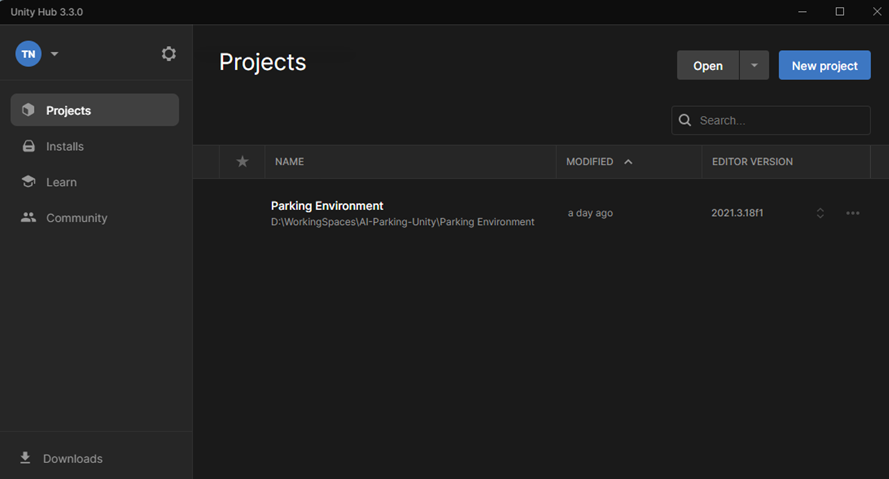
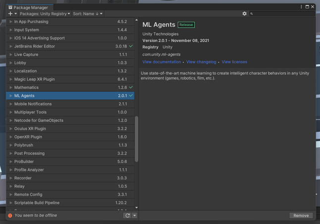
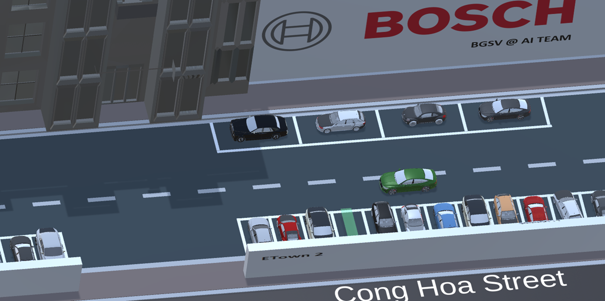

<!-- Banner -->
<p align="center">
  <a href="https://www.bosch.com.vn/" title="Bosch Global Software Technologies" style="border: none;">
     
  </a>
</p>

<h3 align="center"><b>FIT.Fest'23</b></h3>
<h3 align="center"><b>Future.Innovation.Technology</b></h3>
<h1 align="center"><font color=""><b>Master Class</b></font></h1>

# Introduction
In this repository, we provide our source code for 2 topic License Plate Recognition and Self-parking Car. We also have mandatory to guild implement our experiment step by step.


* [License Plate Recognition](#LicensePlateRecognition)
* [Self-parking Car](#Self-parking-(Car))

# License Plate Recognition


# Self-parking Car


<details> 
  <summary><b>Install the mlagents library</b></summary><br/>

```
pip install ml-agents
```

<p align="center">
  
</p>

</details>

<details> 
  <summary><b>Install UnityHub and Unity Editor</b></summary><br/>

Next step, please use this  [link](https://unity.com/download) to install UnityHub and then install Unity Editor via UnityHub. 


<p align="center">
  
</p>

Use the Unity Editor to open the project we have provided, to make sure everything works, please check the ML-Agents package in PackageManagement to see if it is already installed

<p align="center">
  
</p>

Take a look to our environment. 

<p align="center">
  
</p>

</details>

<details> 
  <summary><b>Training model</b></summary><br/>


```
mlagents-learn trainner_settings.yaml --run-id='AITeam_FitFest2023'
```


